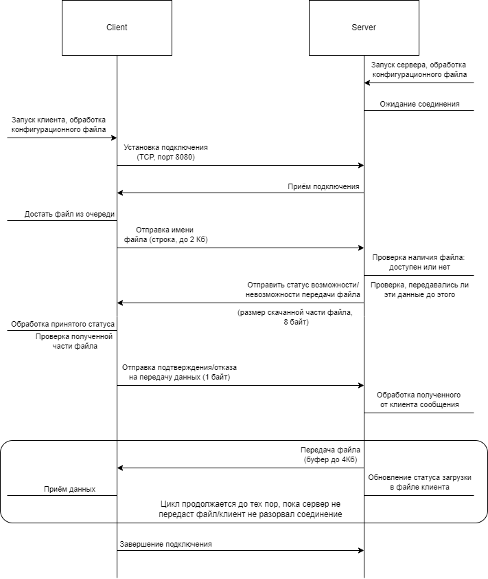

# Задание

Разработать приложение для передачи файлов с поддержкой догрузки в случае разрыва соединения. Программа-клиент инициирует запрос на загрузку, отправляя программе-серверу название требуемого файла. Сервер проверяет доступность файла в заданной папке, подтверждает возможность или невозможность передачи и, если файл доступен, начинает отправку. Успешное завершение передачи подтверждается дополнительным сообщением. В ситуации преждевременного разрыва соединения необходимо предусмотреть возможно «докачки» неотправленной части файла посредством отправки специального сообщения. Размер передаваемых файлов — до 64 Гб.

На клиенте необходимо реализовать консольный интерфейс, обеспечивающий визуализацию процесса загрузки файла.

- Для приложения необходимо разработать сетевой протокол прикладного уровня на основе TCP (5 баллов).
- Приложение-сервер должно поддерживать одновременную работу с неограниченным числом клиентов (в пределах вычислительных возможностей компьютера) по разработанному сетевому протоколу. Сервер необходимо реализовать как многопроцессное приложение с использованием сокетов в блокирующем режиме (20 баллов).
- Клиент должен работать по разработанному сетевому протоколу (5 баллов).

# Описание входных данных
Клиент получает на вход конфигурационный файл, в котором содержится:
1) идентификатор клиента (8 байт),
2) адрес и порт сервера, к которому нужно подключиться,
3) список файлов для передачи.

В качестве входных данных серверу передаётся конфигурационный файл, в котором содержится:
1) хост и порт сервера, 
2) размер буфера для считывания (до 4 Кб),
3) директория, в которой будут храниться файлы с информацией о статусе скачивания каждого файла.

# Схема протокола

